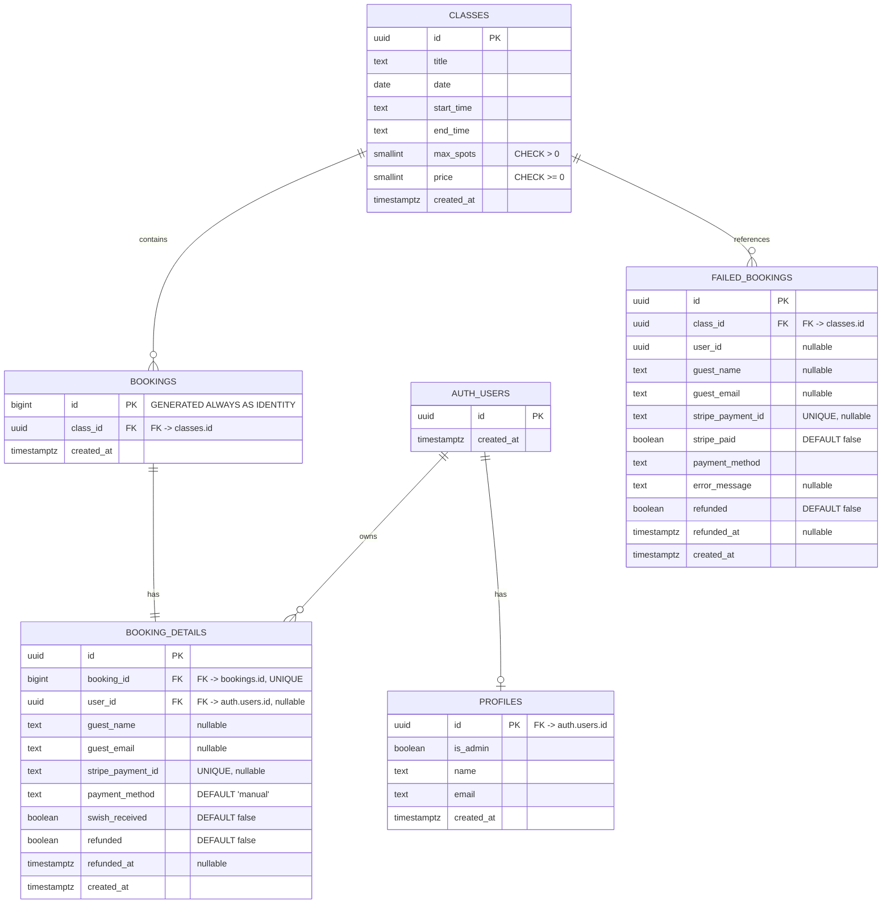

# Supabase Schema Documentation

**Version:** 1.0
**Last Updated:** 2026-01-14
**Status:** Production

---

## Table of Contents

1. [Overview](#overview)
2. [Entity-Relationship Diagram](#entity-relationship-diagram)
3. [Table Reference](#table-reference)
4. [RLS Policies](#rls-policies)
5. [Data Integrity Guarantees](#data-integrity-guarantees)

---

## Overview

This document describes the database schema for a boutique pilates studio booking system handling approximately 20-30 bookings per week. The design philosophy prioritizes **simplicity over over-engineering**, making intentional trade-offs that align with the studio's scale and operational needs.

### Studio-Scale Design Philosophy

**Hard Deletes Over Soft Deletes**

The system uses hard deletes (actual `DELETE` operations) rather than soft deletes (marking records as deleted). This decision reflects the reality that:

- **Low Volume:** With ~20-30 bookings/week, data retention concerns are minimal
- **Operational Simplicity:** Hard deletes eliminate the need for `deleted_at` flags, complex queries filtering deleted records, and cleanup jobs
- **Data Privacy:** GDPR compliance is simpler when data is actually removed, not just hidden
- **Performance:** Fewer columns and simpler queries improve response times at this scale

**Database Constraints Over Application Validation**

Critical business rules are enforced at the database level, not just in application code:

- **UNIQUE constraints** prevent duplicate payment IDs (`stripe_payment_id`)
- **CHECK constraints** ensure `max_spots > 0` and `price >= 0`
- **Foreign key constraints** with `RESTRICT` prevent orphaned data
- **NOT NULL constraints** enforce required fields

This approach provides a **fail-safe layer** that prevents data corruption even if application logic has bugs or is bypassed. For a small team, database-level constraints are more reliable than remembering to add validation in every API route.

**Skipped "Enterprise" Features**

Several features commonly found in larger systems are intentionally omitted:

- **Rate Limiting:** Supabase's built-in limits are sufficient for this volume. Custom rate limiting would add complexity without measurable benefit.
- **Complex Caching:** With low query volume, database queries are already sub-millisecond. Caching layers would add operational overhead.
- **Audit Logs:** The `failed_bookings` table serves as a lightweight audit trail for payment failures. Full audit logging would be overkill.
- **Soft Deletes:** As mentioned above, hard deletes are simpler and sufficient.

These omissions are **intentional architectural decisions**, not oversights. The system is designed to scale to ~100 bookings/week before requiring architectural changes.

### Key Design Decisions

**Bookings Are Not Soft-Deleted**

When a booking is cancelled or refunded, the record is permanently removed from the database. This simplifies queries (no `WHERE deleted_at IS NULL` filters) and reduces storage. The `failed_bookings` table captures payment failures that need manual review, but successful bookings that are later cancelled are simply deleted.

**Separation of Public and Private Data**

The schema separates `bookings` (public metadata: `id`, `class_id`, `created_at`) from `booking_details` (private data: `user_id`, `guest_email`, `stripe_payment_id`). This allows:

- Public endpoints to return booking counts without exposing PII
- RLS policies to protect sensitive data while allowing public reads of booking metadata
- Cleaner data model where booking existence is separate from booking ownership

**No User-Level Booking Constraints**

The system intentionally does **not** enforce `UNIQUE(class_id, user_id)` at the database level. This allows:

- Users to book multiple spots for the same class (e.g., booking for a friend)
- Flexible business logic that can change without schema migrations
- Technical duplicate prevention via `stripe_payment_id` UNIQUE constraint instead

---

## Entity-Relationship Diagram

### Relationship Notes

- **AUTH_USERS → PROFILES:** One-to-one (1:1). Each authenticated user has exactly one profile record.
- **CLASSES → BOOKINGS:** One-to-many (1:N). A class can have multiple bookings (up to `max_spots`).
- **BOOKINGS → BOOKING_DETAILS:** One-to-one (1:1). Each booking has exactly one detail record (enforced by `UNIQUE(booking_id)`).
- **AUTH_USERS → BOOKING_DETAILS:** One-to-many (1:N). A user can have multiple bookings (or none if guest checkout).
- **CLASSES → FAILED_BOOKINGS:** One-to-many (1:N). A class can have multiple failed booking attempts logged.

---

## Table Reference

### `profiles`

**Purpose:** User profile data linked to Supabase Auth users.

**Key Columns:**

- `id` (uuid, PK, FK → `auth.users.id`): Primary key matching the authenticated user ID
- `is_admin` (boolean, DEFAULT false): Role flag for admin privileges
- `name` (text, nullable): User's display name
- `email` (text, nullable): User's email address
- `created_at` (timestamptz): Profile creation timestamp

**Constraints:**

- Primary key references `auth.users(id)` (enforced by foreign key)
- `is_admin` defaults to `false` (new users are not admins by default)

**Usage:**

- Admin authorization via `requireAdmin()` checks `is_admin = true`
- User profile display in dashboard
- Email notifications use `name` and `email` fields

---

### `classes`

**Purpose:** Pilates class sessions available for booking.

**Key Columns:**

- `id` (uuid, PK): Unique identifier for each class
- `title` (text, NOT NULL): Class name (e.g., "Core Pilates")
- `date` (date, NOT NULL): Class date (YYYY-MM-DD format)
- `start_time` (text, NOT NULL): Start time (e.g., "14:00")
- `end_time` (text, NOT NULL): End time (e.g., "15:00")
- `max_spots` (smallint, NOT NULL, CHECK > 0): Maximum number of bookings allowed
- `price` (smallint, NOT NULL, CHECK >= 0): Price in SEK (Swedish kronor)
- `created_at` (timestamptz): Class creation timestamp

**Constraints:**

- `max_spots > 0`: Prevents creating classes with zero or negative capacity
- `price >= 0`: Prevents negative pricing (free classes are allowed)
- Foreign key from `bookings.class_id` uses `RESTRICT` (prevents deletion if bookings exist)

**Anti-Overbooking Mechanisms:**

- `max_spots` CHECK constraint ensures valid capacity
- Application logic performs double-check pattern before insert (see `processBooking` in `booking-service.ts`)
- Database constraint prevents impossible states (negative spots)

**Usage:**

- Public read access for class listings
- Admin-only write access (create, update, delete)
- Capacity calculations compare `bookings.length` to `max_spots`

---

### `bookings`

**Purpose:** Public booking records (metadata only, no PII).

**Key Columns:**

- `id` (bigint, PK, GENERATED ALWAYS AS IDENTITY): Auto-incrementing booking ID
- `class_id` (uuid, FK → `classes.id`): Reference to the booked class
- `created_at` (timestamptz): Booking creation timestamp

**Constraints:**

- Foreign key to `classes.id` with `RESTRICT` (prevents class deletion if bookings exist)
- No UNIQUE constraint on `(class_id, user_id)` - intentional design to allow multiple spots per user

**Anti-Overbooking Mechanisms:**

- Capacity checks in application logic (see `processBooking`)
- Double-check pattern before insert (race condition protection)
- `max_spots` CHECK constraint on `classes` table prevents invalid capacity

**Usage:**

- Public read access for capacity calculations (`bookings.length`)
- Admin-only write access
- Joined with `booking_details` for full booking information

---

### `booking_details`

**Purpose:** Private booking data (PII, payment info, ownership).

**Key Columns:**

- `id` (uuid, PK): Unique identifier
- `booking_id` (bigint, FK → `bookings.id`, UNIQUE): One-to-one relationship with booking
- `user_id` (uuid, FK → `auth.users.id`, nullable): Owner if authenticated user, null for guest checkout
- `guest_name` (text, nullable): Guest name (used for both authenticated and guest bookings)
- `guest_email` (text, nullable): Email address for confirmation
- `stripe_payment_id` (text, UNIQUE, nullable): Stripe PaymentIntent ID (prevents duplicate processing)
- `payment_method` (text, DEFAULT 'manual'): One of `'manual'`, `'stripe'`, `'swish'`
- `swish_received` (boolean, DEFAULT false): Flag for Swish payment confirmation
- `refunded` (boolean, DEFAULT false): Refund status
- `refunded_at` (timestamptz, nullable): Timestamp of refund
- `created_at` (timestamptz): Detail creation timestamp

**Constraints:**

- `booking_id` UNIQUE: Ensures one detail record per booking (prevents data inconsistency)
- `stripe_payment_id` UNIQUE: Prevents duplicate booking processing (idempotency guarantee)
- Foreign key to `bookings.id` ensures referential integrity
- Foreign key to `auth.users.id` (nullable) for authenticated bookings

**Anti-Overbooking Mechanisms:**

- `stripe_payment_id` UNIQUE constraint prevents duplicate webhook processing
- Idempotency checks query this table before creating new bookings

**Usage:**

- Protected by RLS (users see only their own bookings)
- Admin access via `supabaseAdmin` bypasses RLS
- Used for email confirmations, refund processing, and user dashboard

---

### `failed_bookings`

**Purpose:** Safety net for payments that succeeded but booking creation failed.

**Key Columns:**

- `id` (uuid, PK): Unique identifier
- `class_id` (uuid, FK → `classes.id`): Reference to the class that failed
- `user_id` (uuid, nullable): User ID if authenticated
- `guest_name` (text, nullable): Guest name
- `guest_email` (text, nullable): Guest email
- `stripe_payment_id` (text, UNIQUE, nullable): Stripe PaymentIntent ID
- `stripe_paid` (boolean, DEFAULT false): Confirmation that payment succeeded
- `payment_method` (text, NOT NULL): Payment method used
- `error_message` (text, nullable): Error description for manual review
- `refunded` (boolean, DEFAULT false): Whether refund has been processed
- `refunded_at` (timestamptz, nullable): Refund timestamp
- `created_at` (timestamptz): Failure timestamp

**Constraints:**

- Foreign key to `classes.id` ensures class exists
- `stripe_payment_id` UNIQUE prevents duplicate logging

**Usage:**

- Admin-only access for manual review
- Used to identify payments that need refunds
- Logged automatically by `logFailedBooking()` in `booking-service.ts`

**Recovery Workflow:**

1. Admin reviews `failed_bookings` table
2. Verifies payment in Stripe dashboard
3. Initiates refund via `/api/refund` endpoint
4. Marks record as `refunded: true`

---

## RLS Policies

**Status:** Verified, Fixed & Active (per security audit 2026-01-13)

**Note:** RLS policies are configured in Supabase and enforced at the database level. The following policies are documented based on the security audit verification and code patterns.

### `profiles`

**Read Policy:**

- Users can read their own profile (`id = auth.uid()`)
- Admins can read all profiles (via `supabaseAdmin` bypass in API routes)

**Write Policy:**

- Users can create their own profile during signup (POST `/api/profiles`)
- Admins can update any profile (via `supabaseAdmin`)

**Security Model:**

- User-scoped reads prevent data leakage
- Admin writes require `requireAdmin()` middleware check

---

### `classes`

**Read Policy:**

- **Public read access** - Anyone can read class listings
- Used for public class display and capacity calculations

**Write Policy:**

- **Admin-only writes** - All create/update/delete operations require `requireAdmin()`
- Enforced via API route middleware, not RLS (admin uses `supabaseAdmin`)

**Security Model:**

- Public reads enable frictionless booking experience
- Admin-only writes prevent unauthorized class modifications

---

### `bookings`

**Read Policy:**

- **Public read access** - Anyone can read booking metadata (`id`, `class_id`, `created_at`)
- Used for capacity calculations (`bookings.length` vs `classes.max_spots`)
- No PII exposed (sensitive data is in `booking_details`)

**Write Policy:**

- **Admin-only writes** - All create/update/delete operations require `requireAdmin()` or valid payment flow
- Public POST allowed only for Stripe/Swish payment flows (validated server-side)

**Security Model:**

- Public reads for metadata only (no PII)
- Conditional authorization in API routes (see `/api/bookings/route.ts` POST handler)

---

### `booking_details`

**Read Policy:**

- **User-scoped reads** - Users can only read their own booking details (`user_id = auth.uid()`)
- Guest bookings (no `user_id`) are accessible via high-entropy `stripe_payment_id` token
- Admins can read all details (via `supabaseAdmin`)

**Write Policy:**

- **Admin-only writes** - All create/update operations require `requireAdmin()` or webhook signature verification
- Webhook handler uses `supabaseAdmin` to create booking details

**Security Model:**

- User-scoped reads prevent unauthorized access to PII
- Ownership checks in `/api/bookings/by-payment-intent` validate `user_id` matches session
- Guest checkout uses `stripe_payment_id` as secure, non-enumerable access token

---

### `failed_bookings`

**Read Policy:**

- **Admin-only reads** - Only administrators can query failed bookings
- Enforced via `requireAdmin()` in `/api/bookings/failed-bookings`

**Write Policy:**

- **System-only writes** - Only `logFailedBooking()` service function can insert records
- Uses `supabaseAdmin` to bypass RLS

**Security Model:**

- Admin-only access prevents exposure of error logs and payment failure details
- System writes ensure consistent error logging

---

## Data Integrity Guarantees

### Double Booking Prevention

**Mechanism:** Application-level double-check pattern + database UNIQUE constraints

**Implementation:**

1. **Idempotency Check:** Query `booking_details` for existing `stripe_payment_id` before creating booking
2. **Capacity Check (First):** Count existing bookings and compare to `max_spots`
3. **Capacity Check (Final):** Re-check capacity immediately before insert (race condition protection)
4. **UNIQUE Constraint:** `stripe_payment_id UNIQUE` prevents duplicate payment processing

**Code Reference:**

- `processBooking()` in `utils/server/booking-service.ts` (lines 28-121)
- Double-check pattern at lines 104-121

**Why Not Database-Level UNIQUE?**

The system intentionally does **not** enforce `UNIQUE(class_id, user_id)` because:

- Business logic allows users to book multiple spots (e.g., for a friend)
- Technical duplicates are prevented via `stripe_payment_id` UNIQUE constraint
- Application logic provides sufficient protection at current scale

---

### Invalid State Prevention

**Mechanism:** CHECK constraints at database level

**Constraints:**

- `classes.max_spots > 0`: Prevents classes with zero or negative capacity
- `classes.price >= 0`: Prevents negative pricing (free classes allowed)

**Enforcement:**

- Database rejects invalid values before they reach application code
- UI validation provides user-friendly feedback, but database is source of truth

**Code Reference:**

- Schema definition in `.cursor/docs/db-schema-raw-sql.md` (lines 33, 35)

---

### Referential Integrity

**Mechanism:** Foreign key constraints with `RESTRICT` behavior

**Constraints:**

- `bookings.class_id` → `classes.id` (RESTRICT): Cannot delete class with active bookings
- `booking_details.booking_id` → `bookings.id` (RESTRICT): Cannot delete booking with details
- `booking_details.user_id` → `auth.users.id` (RESTRICT): Cannot delete user with bookings
- `profiles.id` → `auth.users.id` (RESTRICT): Profile must reference valid user

**Behavior:**

- `RESTRICT` prevents deletion of parent records if child records exist
- Application handles constraint violations with user-friendly error messages
- Example: Deleting a class with bookings returns error: "Kan inte radera: Det finns deltagare bokade på detta pass."

**Code Reference:**

- `/app/api/classes/[id]/route.ts` DELETE handler (lines 68-75) handles FK constraint errors

---

### Orphan Prevention

**Mechanism:** `booking_details.booking_id UNIQUE` constraint + application cleanup logic

**Constraint:**

- `booking_details.booking_id UNIQUE`: Ensures one detail per booking (prevents orphans)

**Cleanup Logic:**

- If `booking_details` insert fails after `bookings` insert, orphaned booking is deleted
- Code reference: `processBooking()` lines 177-185

**Monitoring:**

- `/api/bookings/orphans` endpoint (admin-only) identifies bookings without details
- Used for data integrity audits

---

### Payment Idempotency

**Mechanism:** `stripe_payment_id UNIQUE` constraint

**Guarantee:**

- Same Stripe PaymentIntent cannot create multiple bookings
- Webhook retries are safe (idempotent)
- Duplicate payment processing is prevented at database level

**Code Reference:**

- Idempotency check in `processBooking()` (lines 28-43)
- UNIQUE constraint in schema (line 10 of `db-schema-raw-sql.md`)

---

## 💡 Future Improvements

**Consider if bookings exceed 100/week:**

1. **Database-Level Booking Constraint:** Add `UNIQUE(class_id, user_id)` if business rules change to prevent multiple spots per user
2. **Indexes:** Add indexes on frequently queried columns (`bookings.class_id`, `booking_details.user_id`) if query performance degrades
3. **Soft Deletes:** Implement `deleted_at` flags if data retention requirements change
4. **Audit Logging:** Add comprehensive audit table if compliance requirements increase
5. **Rate Limiting:** Implement custom rate limiting if abuse patterns emerge

**Current Status:** None of these improvements are needed at current scale. The system is designed to handle ~100 bookings/week before requiring architectural changes.
